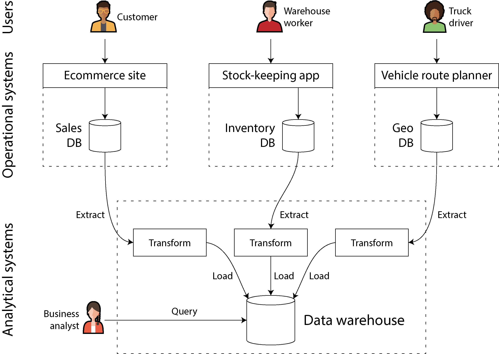

# Ch01 — Trade-Offs in Data Systems Architecture

## Two Systems

There are two systems: **operational** and **analytical**.

- **Operational** — where transactions are created (reads & writes)
- **Analytical** — where data is used for analysis (reads)

We divide these into two separate systems based on their data read and write patterns.

**OLTP** — Online Transaction Processing
From a developer or end-user perspective, this involves reading and writing data to the database.

**OLAP** — Online Analytics Processing
Primarily used for analysis or dashboards. Systems have also been built to display real-time data dashboards to users, even when processing large amounts of data to surface real-time metrics.

A data warehouse is a database where data is extracted, transformed, and loaded from various source databases, allowing analysts to query it freely.
This separation ensures that analytical workloads do not disturb the actual OLTP databases, as heavy queries could degrade their performance and it would be difficult to query across several disparate databases.

