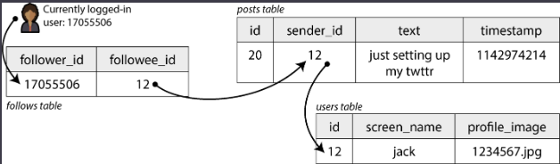

# Case Study: Social Network Home Timelines

Users can post messages and follow other users. Key stats:

- **500 million** posts per day (~5,800 posts/second on average)
- Spikes up to **150,000** posts/second
- Average user follows **200** people and has **200** followers



When a user visits their home page, they should see all posts from the people they follow.

```sql
SELECT posts.*, users.* FROM posts
  JOIN follows ON posts.sender_id = follows.followee_id
  JOIN users   ON posts.sender_id = users.id
  WHERE follows.follower_id = current_user
  ORDER BY posts.timestamp DESC
  LIMIT 1000
```

Posts are supposed to be timely — let's assume that after someone makes a post, their followers should see it within five seconds. One approach is for the client to repeat the query every five seconds while the user is online (this is known as **polling**). If 10 million users are online simultaneously, that would mean running the query 2 million times per second, which is prohibitively expensive.

## How It Works: Feed Caching

Every user has a personal **feed cache** — think of it like a pre-filled inbox sitting on a shelf with your name on it. When someone you follow posts something:

- The server immediately drops that post into your inbox.
- And every other follower's inbox too.

When you open the app, your feed loads instantly because it's already prepared — no heavy computation needed.

> **One-line summary:** Instead of computing your feed when you ask for it, the server builds it ahead of time and just hands it to you when you show up.

## Fan-Out

"Fan-out" means one post → many deliveries. One celebrity posts → the server delivers it to 10 million inboxes. Like one person dropping a letter into 10 million mailboxes.

### The Celebrity Problem

Fan-out breaks down for celebrities. Delivering to 10 million inboxes instantly is too much work, so celebrities get special treatment: their posts are **not** pre-delivered. Instead, when you open your feed, their posts are mixed in at the last second from a separate place.

### Regular Users

Post → instantly fanned out → written into each follower's timeline cache. Done at **write time**.

### Celebrities

Their post is not fanned out to millions of timelines — it just sits in the main database (or its own small cache). When you open your feed, the server:

1. Grabs your pre-built timeline cache (fast).
2. Checks whether you follow any celebrities; if so, fetches their latest posts.
3. Merges both together and returns the final feed.

This merging happens at **read time**, not write time.